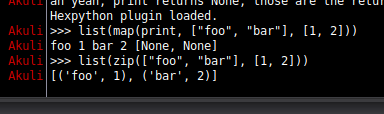

# hexpython
This HexChat plugin runs Python code and sends the result to the current channel.
To use it, type `>>> print(1+2)` to a channel,
and it will automatically appear as if you also typed `3` after that.

Installation: Download `hexpython.py` to your computer and run `/load /path/to/hexpython.py` in HexChat.
